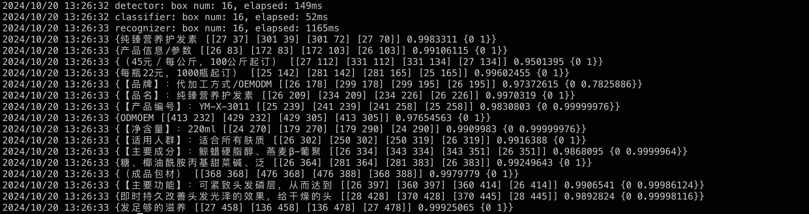

# paddleocr-go

本项目基于 [PaddleOCR-Go](https://github.com/LKKlein/paddleocr-go/tree/dev) 二次开发和完善，适配 Paddle 2.6 版本，是 [PaddleOCR](https://github.com/PaddlePaddle/PaddleOCR) 的 Go 部署版本。具体实现对齐 [PaddleOCR 的 C++ 部署版本](https://github.com/PaddlePaddle/PaddleOCR/blob/release/2.7/deploy/cpp_infer)。

## 环境准备

- Go: 1.21.7
- GoCV: 0.3.5+patch (OpenCV: 4.8.1)
- Paddle: 2.6
- PaddleOCR: 2.7
- 编译环境: Docker [paddle:latest-dev](https://www.paddlepaddle.org.cn/documentation/docs/zh/install/docker/docker_list.html)
```shell
docker pull registry.baidubce.com/paddlepaddle/paddle:latest-dev
docker run --name paddle-test -v $PWD:/paddle --network=host -it registry.baidubce.com/paddlepaddle/paddle:latest-dev /bin/bash
```

## 编译步骤

### 安装 Go
根据 [官方文档](https://go.dev/doc/install) 说明安装。

### 编译 GoCV (OpenCV)
Go 语言通过 [GoCV](https://github.com/hybridgroup/gocv) 使用 OpenCV，它使用 CGO 调用 OpenCV 接口。需要注意，GoCV 官方实现中 MinAreaRect 和 BoxPoints 两个 API 未与 C++ 版 OpenCV 保持一致，会导致计算结果出现数值偏差 ([issue](https://github.com/hybridgroup/gocv/issues/1152))，因此需要对 GoCV 代码打补丁，修正 API 差异。下面是打补丁和编译 GoCV 的命令，GoCV 编译也可以参考 [文档](https://github.com/hybridgroup/gocv?tab=readme-ov-file#how-to-install)。

```shell
# 需要确认 sudo 命令已安装
git clone git@github.com:hybridgroup/gocv.git
cd gocv
git checkout v0.35.0

# 复制 gocv.patch 到 gocv 目录下
git apply --stat gocv.patch
git apply --check gocv.patch
git apply gocv.patch

make install 
```

### 编译 Paddle 的 C 语言预测库
Go 语言只能通过 CGO 调用 C 语言 API，不能直接与 C++ 交互，因此需要编译 Paddle 的 C 语言预测库。当然，也可以自己写 C 语言调用 C++ 的代码和头文件，详见该 [仓库](https://github.com/LKKlein/paddleocr-go/tree/dev_cxx)。

Paddle 提供了 [预编译包](https://www.paddlepaddle.org.cn/inference/master/guides/install/download_lib.html#id1)，也可以自己根据 [官方文档](https://www.paddlepaddle.org.cn/inference/master/guides/install/compile/compile_basic.html) 按需编译。注意部分编译参数需要相关依赖，请确保依赖完整再启用。下面是 CPU 版本的编译的命令。

```shell
git clone https://github.com/PaddlePaddle/Paddle.git
cd Paddle
git checkout release/2.6
mkdir build && cd build

cmake -DWITH_PYTHON=OFF \
      -DWITH_GPU=OFF \
      -DWITH_MKL=ON \
      -DWITH_TESTING=OFF \
      -DCMAKE_BUILD_TYPE=Release \
      -DON_INFER=ON ..

make -j
make inference_lib_dist
```

编译完成后，可以在 `build/paddle_inference_c_install_dir` 目录下，看到以下生成的文件。其中 `paddle` 是 Paddle 的 C 语言预测库，`version.txt` 中包含预测库版本信息。

```
build/paddle_inference_c_install_dir
├── paddle
├── third_party
└── version.txt
```

## 使用 paddleocr-go

### 示例代码

具体使用方法见 demo.go 中的示例代码。注意在 go.mod 将 gocv 替换为打过补丁的 gocv。

```
replace gocv.io/x/gocv => xxx
```

此外，根据 [文档](https://www.paddlepaddle.org.cn/inference/master/guides/quick_start/go_demo.html#go)，需要将 Paddle 的 C 语言预测库软链到 Go 预测库目录下，通常在 `${GOMODCACHE}`，也即 `$GOPATH/pkg/mod`（[文档](https://go.dev/wiki/GOPATH)）。

```shell
# 此处 COMMITID 根据 C 语言预测库的版本不同而不同
go get github.com/paddlepaddle/paddle/paddle/fluid/inference/goapi@${COMMITID}
# 此处 VERSION 根据 go get 的版本不同而不同
cd ${GOMODCACHE}/github.com/paddlepaddle/paddle/paddle/fluid/inference/goapi@${VERSION}
# 此处 paddle_inference_c_install_dir 为下载或编译得到的 C 语言预测库目录
ln -s paddle_inference_c_install_dir paddle_inference_c

# 编译 demo
cd paddleocr-go
go build demo.go
```

示例代码提供了单张图预测、文件夹批量预测两种模式，它们的命令行优先级依次降低。配置文件各字段含义可参考 [文档](https://github.com/PaddlePaddle/PaddleOCR/blob/static/doc/doc_ch/whl.md#%E5%8F%82%E6%95%B0%E8%AF%B4%E6%98%8E) 或 [C++ 实现中的 args.cpp](https://github.com/PaddlePaddle/PaddleOCR/blob/release/2.7/deploy/cpp_infer/src/args.cpp)。

### 单张图预测

```shell
./demo --config config/conf.yaml --image images/test.jpg
```
执行结果：



### 文件夹批量预测

```shell
./demo --config config/conf.yaml --image_dir ./images
```

执行结果：


### Python 版本执行结果


## 参考文献
1. [安装 C API](https://www.paddlepaddle.org.cn/inference/master/guides/install/c_install.html)
2. [Docker 编译](https://www.paddlepaddle.org.cn/documentation/docs/zh/install/compile/linux-compile-by-make.html#compile_from_docker)
3. [安装 Go API](https://www.paddlepaddle.org.cn/inference/master/guides/install/go_install.html)
4. [快速上手 Go 推理](https://www.paddlepaddle.org.cn/inference/master/guides/quick_start/go_demo.html#go)
